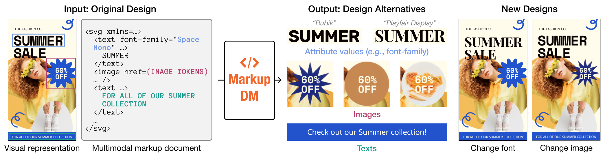

<div align="center">

<h1>Multimodal Markup Document Models for Graphic Design Completion</h1>

<p align="center">
    <a href='https://cyberagentailab.github.io/MarkupDM/'></a>
    <a href="https://arxiv.org/abs/2409.19051"></a>
    <a href="https://opensource.org/license/apache-2-0"></a>
</p>

<p align="center">
    <a href="https://ktrk115.github.io/">Kotaro Kikuchi</a><sup>1</sup> &nbsp;
    <a href="https://ukyh.github.io/">Ukyo Honda</a><sup>1</sup> &nbsp;
    <a href="https://naoto0804.github.io/">Naoto Inoue</a><sup>1</sup> &nbsp;
    <a href="https://mayu-ot.github.io/">Mayu Otani</a><sup>1</sup> &nbsp;
    <a href="https://esslab.jp/~ess/en/">Edgar Simo-Serra</a><sup>2</sup> &nbsp;
    <a href="https://sites.google.com/view/kyamagu">Kota Yamaguchi</a><sup>1</sup>
</p>

<p align="center">
    <sup>1</sup>CyberAgent &nbsp;
    <sup>2</sup>Waseda University
</p>

<p align="center" width="100%">

</p>

</div>

---

This repository contains the inference code and pre-trained models for the paper [Multimodal Markup Document Models for Graphic Design Completion](https://cyberagentailab.github.io/MarkupDM/) (ACM Multimedia 2025).

## Usage

<p>1. Clone this repository:</p>

```bash
git clone https://github.com/CyberAgentAILab/MarkupDM.git
cd MarkupDM
```

<p>2. Install dependencies:</p>

```bash
# Using pip
pip install .

# Or using uv
uv sync
```

<p>3. Install Google Chrome (required for SVG rendering on Linux):</p>

```bash
wget -q -O - https://dl.google.com/linux/linux_signing_key.pub | sudo apt-key add -
sudo sh -c 'echo "deb [arch=amd64] http://dl.google.com/linux/chrome/deb/ stable main" >> /etc/apt/sources.list.d/google-chrome.list'
sudo apt update
sudo apt install google-chrome-stable
```

<p>4. Run inference:</p>

**Image reconstruction:**

Encodes and decodes an input image using the [VQ-VAE](https://arxiv.org/abs/1711.00937) model to test reconstruction quality.

```bash
# If using uv: uv run python inference/reconstruct_image.py ...
# Note: Replace input_image.png with your own image file
python inference/reconstruct_image.py input_image.png \
    --output_path reconstructed_image.png \
    --model_path cyberagent/ldm-vq-f16-rgba
```

**Design completion:**

Generates SVG and PNG files for input, target, and predicted designs from the Crello test dataset.

**Note:** This requires access to [bigcode/starcoderbase-7b](https://huggingface.co/bigcode/starcoderbase-7b). Visit the model page to request access.

```bash
# If using uv: uv run python inference/complete_design.py ...
python inference/complete_design.py \
    --output_dir output \
    --model_path cyberagent/markupdm
```

Output files will be saved in subdirectories within the specified directory:
- `input/`: Input design with missing text
  - `index.html`: HTML file with embedded SVG
  - Referenced assets (PNG images and TTF fonts)
  - `screenshot.png`: Rendered result
- `target/`: Original complete design (same structure as above)
- `pred/`: Model-generated completion (same structure as above)

## Pre-trained Models

Pre-trained models are available on Hugging Face:

- **MarkupDM**: [cyberagent/markupdm](https://huggingface.co/cyberagent/markupdm) - Main model for design completion
- **LDM-VQ-F16-RGBA**: [cyberagent/ldm-vq-f16-rgba](https://huggingface.co/cyberagent/ldm-vq-f16-rgba) - Image tokenizer for RGBA images

## Dataset

See [dataset/README.md](dataset/README.md) for details on the Crello-Instruct dataset used in this project.

## License

This repository is released under the Apache-2.0 license.

## Citation

```bibtex
@inproceedings{Kikuchi2025,
  title     = {Multimodal Markup Document Models for Graphic Design Completion},
  author    = {Kotaro Kikuchi and Ukyo Honda and Naoto Inoue and Mayu Otani and Edgar Simo-Serra and Kota Yamaguchi},
  booktitle = {ACM International Conference on Multimedia},
  year      = {2025},
  doi       = {10.1145/3746027.3755420}
}
```
